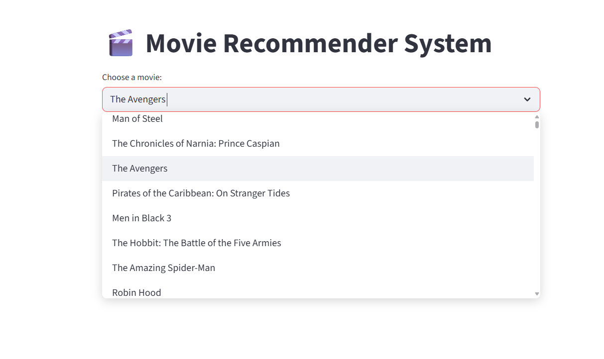
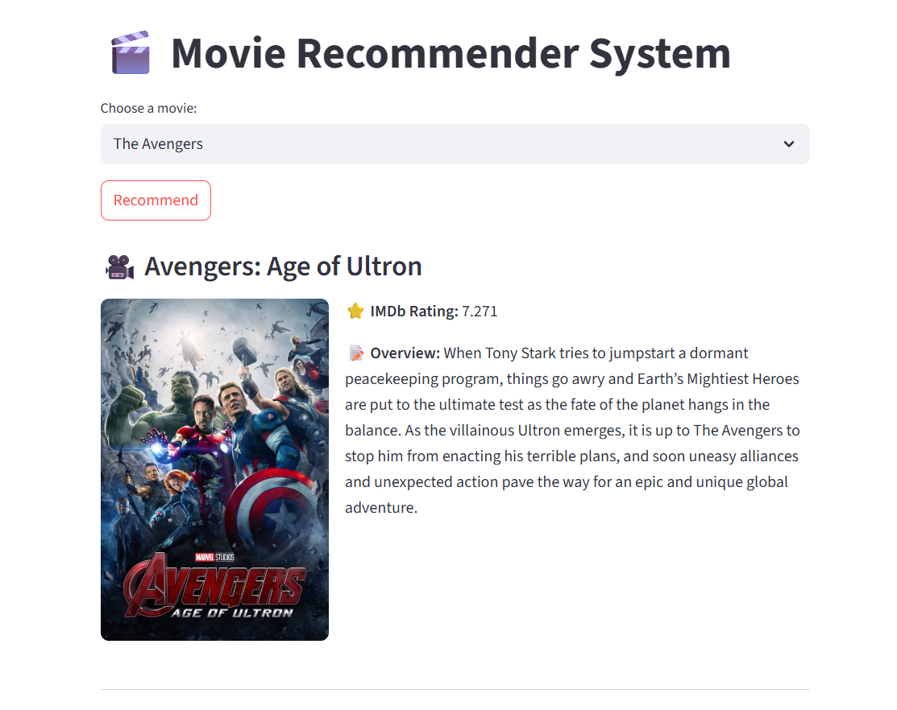
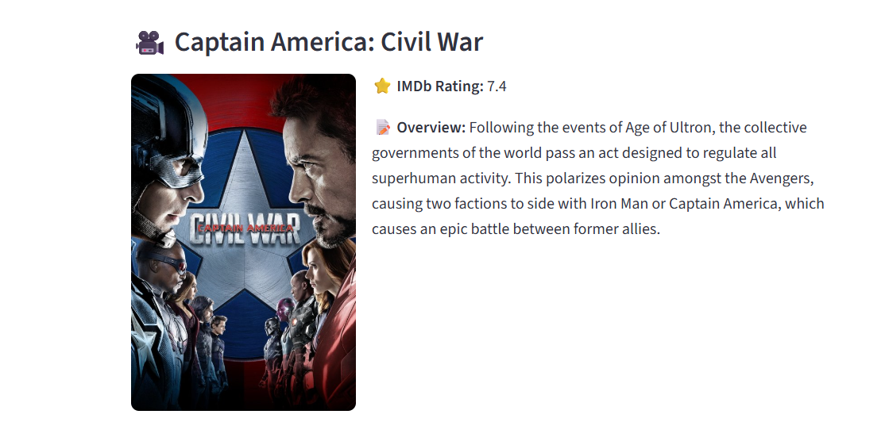
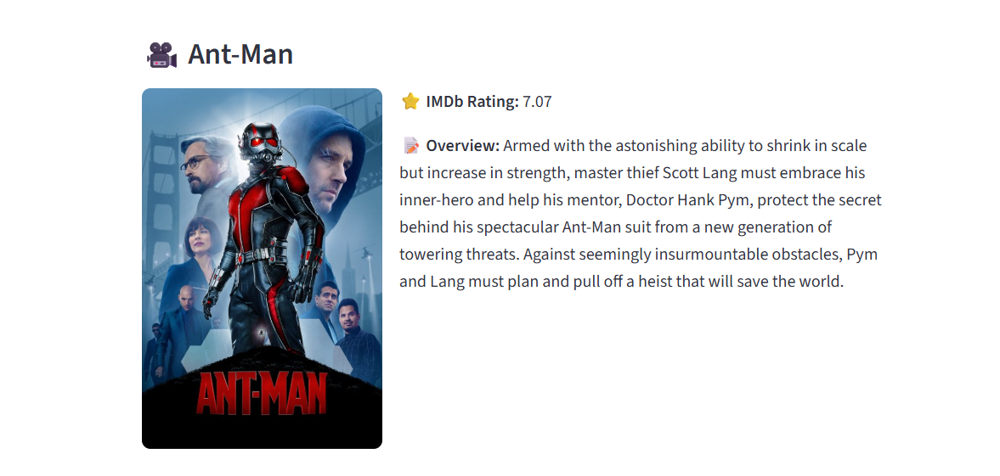

# 🎬 Movie Recommender System

A simple content-based movie recommender system built with **Python** and **Streamlit**, using TMDb data. It suggests similar movies based on your selected title, and shows posters, ratings, and overviews using the TMDb API.

---

## 🚀 Features

- Content-based movie recommendations
- Movie posters via TMDb
- IMDb ratings and overviews
- Simple, interactive UI with Streamlit

---

## 📜 License

This project is licensed under the [MIT License](LICENSE).

---

## 🔑 TMDb API Key Setup

This project requires a [TMDb (The Movie Database)](https://www.themoviedb.org/) API key to fetch movie posters, ratings, and overviews.
generate the api key, put it in apikey.txt to run the project (example shown in apikey.example.txt)

---

## 📁 Dataset Used

This project is based on the TMDb 5000 Movie Dataset from Kaggle.

---

## 🖼️ Sample Output

## 🔁 Rebuilding `.pkl` Files

Due to GitHub's file size limit, `similarity.pkl` is not included in the repository.

To run this project:

1. Ensure `tmdb_5000_movies.csv` and `tmdb_5000_credits.csv` are in the project root.
2. Open `build_similarity_matrix.ipynb`
3. Run all cells to generate:

   - `movies.pkl` (included in the repo)
   - `similarity.pkl` (required to run the app)

Once generated, you can run the app using:

```bash 
streamlit run app.py

### 🔍 Movie Selection



### 🎥 Recommendations







and more ..... 
